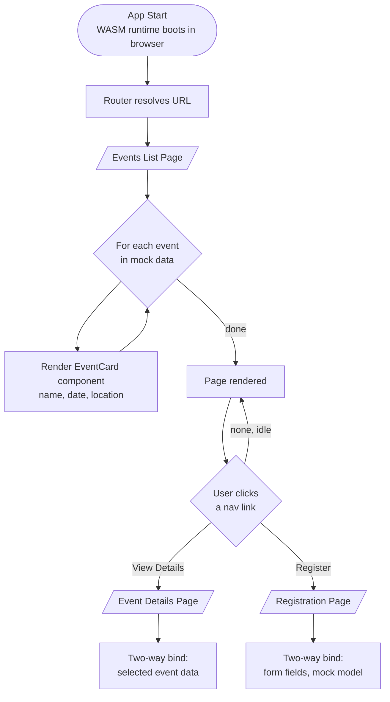
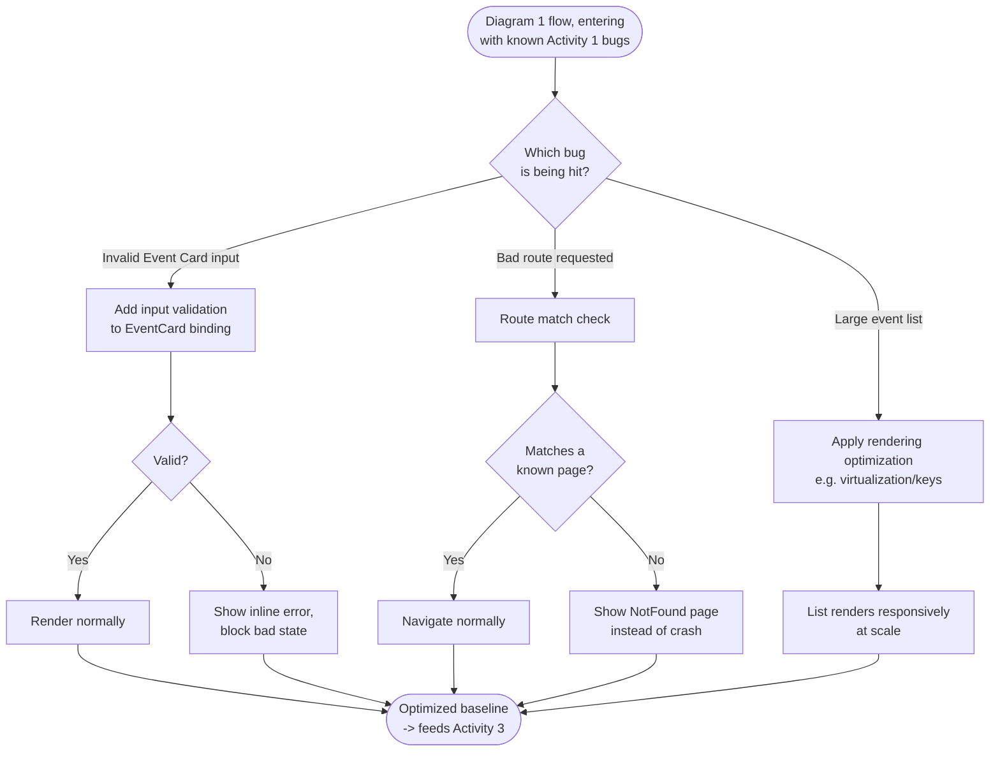
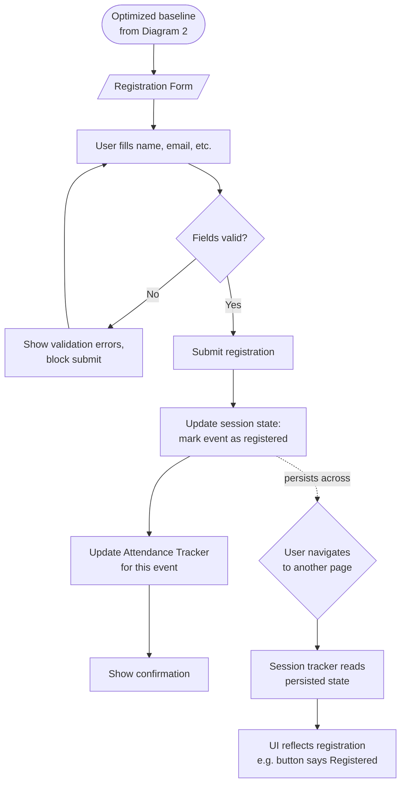

# Preliminary Flowchart — EventEase App (Course 4, Blazor)

**Project:** `c4-capstone-guidelines.json` — EventEase App, three graded Activities (30 pts total)
**Rendering model:** Blazor WebAssembly (client-side)
**Reference style:** `Course2-LibraryManagementSystem-Flowchart.md` (Course 2 flowchart conventions), adapted for a component-based Blazor app rather than a single console loop
**Status:** Preliminary — drafted before code is written, to plan structure and flow ahead of implementation. Not yet verified against final code/file names.

---

## Scope and approach

Blazor is component- and page-based, not a single linear menu loop like the C# console capstones. A single merged flowchart would mean drawing three separate UI concerns (a component's data flow, page-to-page routing, and app-wide state) as one tangled diagram — exactly the kind of complexity this doc is meant to avoid.

Instead, this file has **one flowchart per Activity gate**, matching the three-gate commit workflow already agreed:

| Diagram | Activity | Covers |
|---|---|---|
| 1 | Activity 1 — Foundation | Event Card component (fields + two-way binding) and routing skeleton between List / Details / Registration pages |
| 2 | Activity 2 — Debug & Optimize | Where validation, routing-error handling, and list-rendering optimization slot into Diagram 1's flow |
| 3 | Activity 3 — Expansion | Registration Form validation flow, Session Tracker state, Attendance Tracker state (two separate objects) |

Each diagram stays under roughly a dozen nodes. Where a box would otherwise need a nested decision tree (e.g., full form-field-level validation), it's collapsed into a single "Validate input" node — the *point* of check is shown, not every branch inside it. Line-level detail belongs in `docs/grading-criteria.md` once code exists, not here.

---

## Diagram 1 — Activity 1: Foundation (Event Card + Routing)

**Notes:**
- `EventCard` is the one reusable component this Activity produces — used inside `Loop`, not duplicated per page.
- Two-way binding is shown as a single terminal step per page (`DetailsBind` / `RegBind`); Activity 1 only needs binding to *work*, not be validated yet — that's Activity 2.
- Routing here is "happy path only" — no invalid-path handling drawn, since that's explicitly an Activity 2 concern.

---

## Diagram 2 — Activity 2: Debug & Optimize

**Notes:**
- The three `BugCheck` branches map 1:1 to the three bugs the guidelines name explicitly (binding validation, routing errors, list performance) — no invented failure modes.
- `Perf` is intentionally a single box, not an expanded algorithm — the specific optimization technique is a build-time decision, not a planning-time one.

---

## Diagram 3 — Activity 3: Expansion

**Notes:**
- `SessionUpdate` and `AttendUpdate` are drawn as two boxes and modeled as **two separate state objects** — a Session Tracker (per-user, tracks which events *this* user registered for) and an Attendance Tracker (per-event, tracks registration counts/attendee data for that event). They're updated sequentially on submit but are independent services, not one shared object.
- The dotted line shows *why* state management matters (it survives navigation) without drawing every possible page transition.

---

## Confirmed decisions

- **Rendering model: Blazor WebAssembly.** Confirmed before Activity 1's first commit. Project scaffolding, `.csproj` SDK, and hosting setup should target `blazor wasm`, not Blazor Server or Hybrid — this affects the initial `dotnet new` template choice and should not be revisited mid-build.
- **Session Tracker and Attendance Tracker are two separate state objects.** Session Tracker is per-user/per-session (which events has *this* user registered for); Attendance Tracker is per-event (registration data for *that* event, potentially viewed across users). Both are still mock/in-memory services, not persisted to disk — see below.

## Open design questions (flag for Gate review)

- **Mock data source.** All three diagrams assume in-memory/mock event data (per Activity 1's own wording, "use mock data or a simple data model"). No persistence layer is implied anywhere in this flowchart — confirm this holds through Activity 3 (registration/attendance are also mock-session-scoped, not saved to disk).
- **Not yet built.** This is a planning artifact only, per the project's Gate-based workflow — no `.razor`, `.cs`, or repo changes in this step.

---

*Course 4 · Blazor for Front-End Development · EventEase App capstone (Activities 1–3) · Preliminary flowchart drafted before implementation, per the project's Gate-based workflow.*
