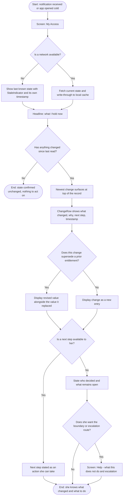
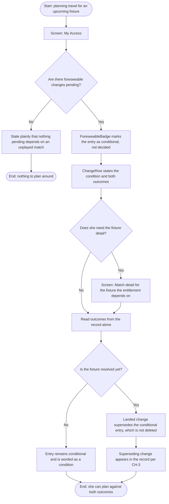
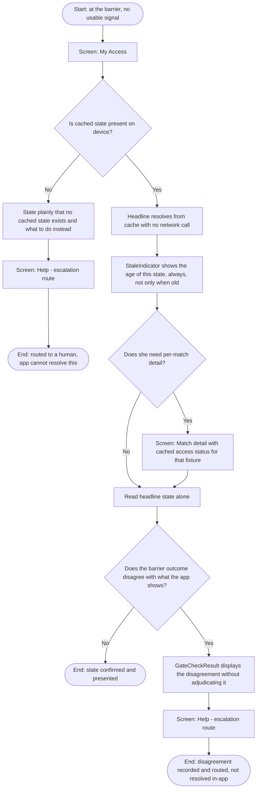

# 04 — TASKS AND SCENARIOS

**Repo path:** `ux-ui/03-ui-prototyping/04_TASKS-AND-SCENARIOS.md`
**Inputs:** `02-ideation/05_CONCEPT.md` §4; `01-design-research/05_ARTIFACTS.md` §1.1, §2, §3, §4; `02_INFORMATION-ARCHITECTURE.md` CH-1…CH-10; `03_UI-DECISIONS.md` §6.
**Mermaid exception applies in this gate only**, per `00_SCOPE.md` §7. No other gate carries diagram markup.

---

## 1. Why three tasks, and why not four

Three tasks, one per core interaction. The count is set by two constraints pulling against each other.

**The ceiling is fatigue.** `04-evaluation` will prompt these specific tasks rather than free exploration, and performance degrades across a session as attention and complexity load accumulate. Every additional task costs measurement quality on the tasks already there.

**The floor is coverage.** The concept ships exactly three core interactions and the inventory is closed — prototyping may not add a fourth (`05_CONCEPT.md` §4). Dropping to two tasks would mean one interaction reaches the build with no test attached to it, which is the same as shipping it unexamined.

Three is therefore not a comfortable middle; it is both the floor and the ceiling at once. A fourth task would need to justify displacing measurement quality on the three that map to the concept's own inventory, and nothing in this dossier does.

**No task is authored for Tomás.** This is a deliberate omission, not an oversight, and it is the partial resolution of W5's navigation objection carried from `02_INFORMATION-ARCHITECTURE.md` §7 item 1. Every task Tomás would actually perform is a bulk task — reassign a crew, check forty credentials at once, propagate one change across a roster. v1 has no bulk surface (Gate 2 §2.3), so authoring a Tomás task here would mean testing him on a single-record workflow he has already said he would not open. His role in this mandate stays what the inherited contract makes it: the constraint every decision must survive, not a user whose tasks get measured. The full objection remains unresolved and is carried to §6.

---

## 2. The materiality threshold — CH-5, resolved here

`02_INFORMATION-ARCHITECTURE.md` CH-5 left the threshold values undetermined and assigned them to this gate. They are set below.

**All values in this section are `[ASSUMPTION]`.** They rest on no research. ID-01 — whether a usable interval exists between a change and its first consequence — is unresolved by declared constraint (`00_SCOPE.md` §4), and if that interval turns out to be zero, every number here is moot rather than wrong. They are stated as concrete values anyway, because a threshold the build cannot implement is not a decision, and `04-evaluation` cannot test a rule expressed as "some appropriate amount of time."

### 2.1 Three urgency classes

| Class | Definition | Behaviour | Basis |
|---|---|---|---|
| **Immediate** | A change that *reduces* what the holder can do, **or** any decision on a pending request, where the consequence lands within **72 hours** | Written to the record **and** interrupts | Delta's rule that contact is timed from how long the person needs to act, not from when the change occurred — `01_BENCHMARKING.md` §2.3 |
| **Foreseeable** | A reducing change that is *conditional* on an unresolved fixture, or whose consequence lands **beyond 72 hours** | Written **and** interrupts once, at the moment it becomes foreseeable — not again when it lands, unless it lands as Immediate | Interaction 4.2; CH-7 |
| **Silent** | A change that does not reduce what the holder can do, and carries no deadline: administrative corrections, accepted document re-uploads, expansions of access, re-affirmation of unchanged state | Written to the record only. Never interrupts | Delta's suppression list — `01_BENCHMARKING.md` §2.3 |

### 2.2 Why 72 hours

Amina's re-planning unit is a flight and a hotel in another host country (`05_ARTIFACTS.md` §1.1: *her budget is booked before her access is confirmed*; §3.2: *she has already paid for the flight to the next host city*). Seventy-two hours is the smallest window in which re-planning intercity travel is plausibly still cheaper than absorbing the loss. It is an inference from the persona's constraints, not a measured figure. `[ASSUMPTION]`

### 2.3 What this publishes

Per CH-6, the Silent class is published in Help — a person must be able to read what will *not* reach them, or silence is indistinguishable from a broken system. The published list is the Silent row above, in plain language.

---

## 3. Task 1 — read what changed and what it means

**Prompt as `04-evaluation` will give it:** *"You've just opened the app. Something about your access has changed since the last time you looked. Find out what changed, why, and what you can do about it."*

| Field | Content |
|---|---|
| **Interaction** | 4.1 — a change lands |
| **Scenario grounding** | `05_ARTIFACTS.md` §3.2, the critical scenario: her team is eliminated, quota contracts, her quarter-final request silently fails. Blueprint stage 10 — the one stage FIFA both causes and fails to communicate |
| **Amina's goal served** | *Knowing where she stands, even when the answer is bad*; *a reason she can act on or learn from* (§2 Gains) |
| **Would she actually do this?** | This is the single behaviour the empathy map records her doing badly today — *discovers changes by attempting an action and failing*. The task is that behaviour, performed successfully |
| **Success** | She states what changed, why it changed, and what her remaining options are, without being told by the facilitator and without leaving My Access |
| **Failure modes worth catching** | She reads the outcome but cannot find the reason; she cannot tell which change is the most recent; she believes a foreseeable change has already happened |

**Note on the K branch.** CH-3 requires the superseded value to remain visible. A change with nothing to compare against is legible as *information*, but not as a *change* — which is the entire distinction this task measures.

---

## 4. Task 2 — find out what is about to change

**Prompt as `04-evaluation` will give it:** *"You're planning travel for next week. Find out whether anything about your access depends on a match that hasn't been played yet, and what happens to you in each outcome."*

| Field | Content |
|---|---|
| **Interaction** | 4.2 — a change becomes foreseeable |
| **Scenario grounding** | §3.2 again, but at the moment *before* the loss: the round-of-16 fixture is the dependency, and the quota contraction is the foreseeable consequence. This is the task that would have prevented the two lost days and the fare |
| **Amina's goal served** | *Enough warning to re-plan rather than react* (§2 Gains); *keep filing after her team goes out* (§1.1 Goals) |
| **Would she actually do this?** | Yes — she *books travel on the assumption of approval* (§2 Does). This task is that assumption made inspectable instead of implicit |
| **Success** | She identifies which fixture her access depends on, and states what her access becomes under both outcomes, without treating either outcome as already settled |
| **Failure modes worth catching** | She reads a conditional entry as a decision already taken; she cannot find the dependency at all; she assumes the app is promising her the favourable outcome |

**Note on the M branch.** CH-7 forbids deleting the conditional entry when the real change lands. The prediction and the outcome both stay in the record — partly so a person can see the system was not silent beforehand, and partly because a record that quietly erases its own wrong guesses is not a record.

---

## 5. Task 3 — confirm your current state when you cannot reach the network

**Prompt as `04-evaluation` will give it:** *"You're at the venue and your phone has no usable signal. Show what access you currently hold, and tell me how confident you are that it's up to date."*

| Field | Content |
|---|---|
| **Interaction** | 4.3 — the state is enforced |
| **Scenario grounding** | Blueprint stage 11: *turnstile, venue access lists, gate list stale vs app state*; §1.1 technical environment — *roaming data across three countries, unreliable in venues* |
| **Amina's goal served** | *Be in the building for every match her team plays* (§1.1 Goals); avoiding the *confidence → possible humiliation* trajectory the blueprint records at stage 11 |
| **Would she actually do this?** | Yes, and under the worst conditions in the whole service — 0–20 minutes at a barrier, with staff and a queue behind her |
| **Success** | She produces her current state offline, and correctly reads how old that state is — the second half matters as much as the first |
| **Failure modes worth catching** | She cannot tell cached data from live data; the staleness indicator is present but she does not register it; she over-trusts a state that is hours old |

**This task tests one half of Interaction 4.3, and the file says so.** The holder-side half — can she produce and correctly read her state under the worst conditions — is testable in a browser. The barrier-side half — whether the venue access list actually agrees with the record — is not, because venue access list ownership is unresolved (`06_HANDOFF.md` rec 4, carried at Gate 2 §4.4). `GateCheckResult` therefore *displays* a disagreement and routes it; it never claims to arbitrate one. An evaluation that scores this task as covering 4.3 end-to-end would be overclaiming. `[SOURCED]`

---

## 6. Consistency check — screens named here

Every screen named in a flowchart above, for Gate 5 to specify. Gate 5 may add supporting surfaces, but each must be justified there as supporting rather than appear unexplained.

| Screen | Appears in | Component load from `03_UI-DECISIONS.md` §6 |
|---|---|---|
| **My Access** | Tasks 1, 2, 3 | AccessCard, ChangeRow, ForeseeableBadge, StaleIndicator |
| **Match detail** | Tasks 2, 3 | MatchCard, cached per-fixture access status |
| **Help — what this does not do / escalation** | Tasks 1, 3 | Static staged content; C20 and C21 |
| **GateCheckResult** | Task 3 | Displayed outcome only; no data-source assumption |

**Screens Gate 5 must justify as supporting, since no task above reaches them:** Matches list, Request access, Sign in. Each exists for good reason — Matches is the route to Match detail, Request access is the app's existing write path, Sign in is the door — but none is exercised by a task, and Gate 5 owes that justification explicitly rather than including them by inheritance.

**A consequence worth naming.** Request access is the app's only *write* surface, and no task tests it. That is a deliberate consequence of scoping tasks to the three core interactions, all three of which are about a change *arriving* rather than being *made*. If `04-evaluation` finds the request flow broken, this dossier will not have predicted it.

---

## 7. What v1 deliberately does not do well

| Not done well | Consequence | Carried to |
|---|---|---|
| **Anything in bulk** | Tomás opens a single-record surface, finds no roster view, and keeps the spreadsheet — exactly as he said he would. v1 does not serve him and does not pretend to | v2. Needs a different permission model — one person reading many people's entitlements — which is a build in itself (Gate 2 §2.3) |
| **Efficiency and flexibility paths** | The heuristic 7 gap from `03_UI-DECISIONS.md` §7 is resolved by declaring it out of scope, not by filling it. No shortcuts, no saved views, no power-user affordances. Amina is a reluctant user, not a frequent one — *uses the app because she has to, not because she likes it* | v2, and only if evaluation shows repeat-visit friction |
| **Cancel or undo on a submitted request** | The heuristic 3 gap. Reversing a request is a write path, and CH-1 permits no second one — so this is a data-model question about whether withdrawal is itself a change written to the record, not a UI affordance to bolt on | Gate 6 entity model, then v2 |
| **Explaining the silence before a first decision** | Blueprint stage 5 is the longest silence in the service and the concept explicitly does not fix it (`06_HANDOFF.md` §5). The app has nothing to say during vetting because FIFA has nothing to tell it | Not a product problem. Out of scope permanently |
| **Anything about visas** | The tragic scenario stays unprevented. The one adjacent thing the platform could do — warn that single-entry and cross-border fixtures are incompatible — is a rules-engine feature, not a task | v2 at the earliest; the boundary row stands |
| **Arbitrating a barrier disagreement** | Task 3 routes it to a human and stops. Until access list ownership is settled, arbitration would be a guess presented as an answer | Blocked on `06_HANDOFF.md` rec 4 |

---

## 8. Carried into Gate 5

| # | Item | Owner |
|---|---|---|
| 1 | Four screens specified above must appear in Gate 5 | Gate 5 |
| 2 | Matches, Request access and Sign in need explicit supporting-surface justification | Gate 5 |
| 3 | Withdrawal-as-a-change is unresolved; affects whether Request access needs a cancel path | Gate 6, then Gate 5 revisit if it changes |
| 4 | W5's navigation objection remains open — §1 answers why no Tomás task exists, not whether the front door is wrong | Gate 5, or explicitly deferred to v2 |
| 5 | All §2 threshold values are `[ASSUMPTION]` and untested; `04-evaluation` cannot validate them either, since it tests the build rather than the interval | Gate 8 limitations |

---

✅ GATE 4 COMPLETE — `04_TASKS-AND-SCENARIOS.md`
